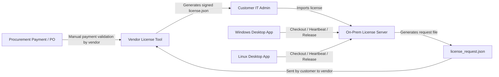

# On-Prem Floating License Server MVP Plan

This file is the high-level MVP product overview. The current implementation,
deployment, and install guidance now lives in the canonical `doc/` tree:

- `doc/architecture/deployment_architecture.md`
- `doc/prd/license_server_prd.md`
- `doc/implementation/windows_packaging_and_clean_install.md`
- `doc/operations/license_server_customer_install.md`

## Purpose

This document defines the MVP licensing architecture for `Surrogate Model Training Suite` as an
on-prem floating-license product for B2B customers.

The intended commercial motion is:

- customer engineers evaluate the product through a 14-day floating-license POC
- customer procurement pays through an offline business process such as PO, invoice, or wire
- the vendor manually validates payment
- the vendor issues a signed license file
- customer IT imports the license into an on-prem license server
- Windows and Linux desktop users check out floating seats from that local server

This design intentionally avoids:

- end-user payment flows
- end-user accounts and email identities
- cloud-only runtime licensing
- separate trial and production licensing systems

## Goals

- use one licensing architecture for evaluation and paid use
- support floating seats without individual named users
- support both Windows and Linux desktop clients
- support customer-hosted license servers on Windows and Linux
- allow evaluation-to-paid conversion by replacing the imported license file
- keep the implementation simple enough for an MVP

## Non-Goals

- self-service checkout, Stripe, Paddle, or Lemon Squeezy integration
- redundant license server triads
- license borrowing for offline laptops
- user SSO, LDAP, or named-user administration
- hardened anti-tamper beyond signed licenses and reasonable host binding
- central telemetry or mandatory phone-home behavior

## Product Terms for MVP

- one active imported license per customer license server
- one running app instance consumes one floating seat
- evaluation licenses are time-limited and non-production
- paid licenses are time-limited term licenses
- eval and paid licenses use the same license server, client protocol, and app UI

Recommended defaults:

- evaluation term: 14 days
- evaluation seats: 1 seat by default, 2 to 3 seats by approval
- lease TTL: 2 minutes
- heartbeat interval: 30 seconds
- temporary grace after heartbeat loss: 5 minutes

## Roles

- Vendor licensing admin: creates and signs licenses after approving evals or validating payment.
- Customer IT admin: installs the license server, generates the request file, imports the signed license, and shares the server address with users.
- Customer engineer: launches the desktop app and checks out a seat from the on-prem server.

## High-Level Architecture



## End-to-End Flows

### Evaluation Flow

1. Vendor agrees to a 14-day floating-license POC.
2. Customer IT installs the on-prem license server on Windows or Linux.
3. License server generates `license_request.json`.
4. Customer sends the request file to the vendor.
5. Vendor generates a signed evaluation `license.json`.
6. Customer imports the license into the on-prem server.
7. Engineers point the app to the server and check out seats.
8. At the end of the term, the license expires automatically unless the vendor issues an extension.

### Paid Conversion Flow

1. Customer procurement completes the offline purchasing process.
2. Vendor manually validates payment.
3. Vendor generates a paid `license.json` for the same server identity.
4. Customer imports the new license into the server.
5. The server replaces the evaluation license with the paid license.
6. Desktop clients continue using the same server address and protocol.

### Runtime Seat Flow

1. User launches the app.
2. App loads configured license server address.
3. App requests a seat using `POST /api/v1/checkout`.
4. If a seat is granted, the app receives a `lease_id` and `expires_at`.
5. App heartbeats every 30 seconds using `POST /api/v1/heartbeat`.
6. On clean exit, the app calls `POST /api/v1/release`.
7. If the app crashes, the lease expires after the TTL and the seat returns automatically.

## Operating System Support

### Windows Desktop Client

- packaged desktop app for Windows users
- license server setting stored in user profile config
- machine identity derived from stable machine properties plus hostname
- app should run without requiring administrator rights

Suggested config location:

- `%APPDATA%\Surrogate Model Training Suite\license_client.json`

### Linux Desktop Client

- packaged desktop app for Linux users
- license server setting stored in XDG config location
- machine identity derived from stable machine properties plus hostname

Suggested config location:

- `~/.config/mlp-training-studio/license_client.json`

### Windows License Server

- packaged as a Windows Service
- data directory under `%PROGRAMDATA%\MLP License Server\`
- CLI-only admin flow for the MVP
- customer IT opens one TCP port on the LAN

Suggested files:

- `%PROGRAMDATA%\MLP License Server\server_identity.json`
- `%PROGRAMDATA%\MLP License Server\active_license.json`
- `%PROGRAMDATA%\MLP License Server\license.db`
- `%PROGRAMDATA%\MLP License Server\logs\`

### Linux License Server

- packaged as a `systemd` service
- configuration in `/etc/mlp-license-server/`
- data in `/var/lib/mlp-license-server/`
- logs through `journald` plus optional file logs
- CLI-only admin flow for the MVP

Suggested files:

- `/etc/mlp-license-server/config.toml`
- `/var/lib/mlp-license-server/server_identity.json`
- `/var/lib/mlp-license-server/active_license.json`
- `/var/lib/mlp-license-server/license.db`

## Trust and Security Model

### Vendor-Side Trust

- vendor private signing key never leaves vendor control
- signed licenses are the source of truth for seat count, features, and term
- customer servers verify signatures using an embedded vendor public key

### Customer-Side Trust

- customer server is trusted to enforce floating-seat leases locally
- desktop clients never trust a locally stored seat count
- desktop clients trust only the license server's lease responses

### MVP Host Binding

For MVP, bind the issued license to a stable server identity:

- generated `server_id`
- host fingerprint
- product name

This is sufficient for an MVP and easier to support than a full certificate workflow.

Upgrade path for later:

- replace host fingerprint binding with a local server keypair and signed requests

### Suggested Signing

- algorithm: `Ed25519`
- signature format: base64
- license envelope contains `algorithm`, `key_id`, `payload`, and `signature`

## License Request File

The customer server generates this file on first install and after explicit re-registration.

Example:

```json
{
  "schema_version": 1,
  "product": "Surrogate Model Training Suite",
  "server_id": "srv_6f9f6a4f7f2e",
  "host_fingerprint": "host_5a7d0d8d3d95",
  "hostname": "mlp-license-01",
  "os_family": "linux",
  "generated_at": "2026-03-13T18:45:00Z",
  "requested_by": "customer_it_optional"
}
```

Field meanings:

- `server_id`: persistent ID created once and stored on disk
- `host_fingerprint`: deterministic hash of stable host information
- `hostname`: human-readable diagnostics only
- `os_family`: used for support diagnostics

## Signed License File

Envelope example:

```json
{
  "algorithm": "Ed25519",
  "key_id": "2026-01",
  "payload": {
    "schema_version": 1,
    "license_id": "lic_2026_0001",
    "license_type": "evaluation",
    "product": "Surrogate Model Training Suite",
    "company_name": "Acme Design House",
    "server_id": "srv_6f9f6a4f7f2e",
    "host_fingerprint": "host_5a7d0d8d3d95",
    "seat_count": 2,
    "features": ["baseline", "transfer"],
    "starts_at": "2026-04-01T00:00:00Z",
    "ends_at": "2026-04-30T23:59:59Z",
    "notes": "14-day floating POC, non-production"
  },
  "signature": "BASE64_SIGNATURE_HERE"
}
```

Rules:

- evaluation and paid licenses share the same schema
- paid conversion replaces the imported license with a new signed payload
- `seat_count` is the floating concurrency limit
- `features` allows future feature-tier expansion without redesigning the format

## License Server API

All client endpoints should return JSON.

Suggested LAN URL:

- `http://<server-host>:27850/api/v1/...`

The port should be configurable.

### `POST /api/v1/checkout`

Purpose:

- request one floating seat

Request:

```json
{
  "product": "Surrogate Model Training Suite",
  "product_version": "0.1.0",
  "machine_id": "cli_7bde9f61",
  "hostname": "eda-win-17",
  "username": "jdoe",
  "platform": "windows"
}
```

Success response:

```json
{
  "granted": true,
  "lease_id": "lease_001",
  "heartbeat_interval_seconds": 30,
  "lease_ttl_seconds": 120,
  "grace_seconds": 300,
  "expires_at": "2026-04-10T15:22:00Z",
  "license_type": "evaluation",
  "company_name": "Acme Design House",
  "seat_count": 2,
  "seats_in_use": 1
}
```

Denied response:

```json
{
  "granted": false,
  "reason_code": "all_seats_in_use",
  "message": "All floating seats are currently in use."
}
```

Common `reason_code` values:

- `all_seats_in_use`
- `license_expired`
- `license_not_started`
- `feature_not_enabled`
- `server_binding_mismatch`
- `invalid_license`

### `POST /api/v1/heartbeat`

Purpose:

- extend an existing lease

Request:

```json
{
  "lease_id": "lease_001",
  "machine_id": "cli_7bde9f61"
}
```

Success response:

```json
{
  "ok": true,
  "expires_at": "2026-04-10T15:22:30Z"
}
```

### `POST /api/v1/release`

Purpose:

- release a seat on clean shutdown

Request:

```json
{
  "lease_id": "lease_001"
}
```

Response:

```json
{
  "ok": true
}
```

### `GET /api/v1/status`

Purpose:

- client-readable summary for connection tests and support

Response:

```json
{
  "ok": true,
  "product": "Surrogate Model Training Suite",
  "company_name": "Acme Design House",
  "license_type": "evaluation",
  "starts_at": "2026-04-01T00:00:00Z",
  "ends_at": "2026-04-30T23:59:59Z",
  "seat_count": 2,
  "seats_in_use": 1
}
```

### `POST /api/v1/admin/import-license`

Purpose:

- import or replace the active signed license

Rules:

- admin-only
- verifies vendor signature
- verifies `server_id` and `host_fingerprint`
- immediately evicts excess active leases if the new license reduces seat count below current usage

### `GET /api/v1/admin/audit`

Purpose:

- local admin support view

Returns:

- recent checkout, heartbeat timeout, release, and import events

## SQLite Schema for MVP

```sql
CREATE TABLE server_identity (
    id INTEGER PRIMARY KEY CHECK (id = 1),
    server_id TEXT NOT NULL,
    host_fingerprint TEXT NOT NULL,
    hostname TEXT NOT NULL,
    os_family TEXT NOT NULL,
    created_at TEXT NOT NULL
);

CREATE TABLE active_license (
    id INTEGER PRIMARY KEY CHECK (id = 1),
    license_id TEXT NOT NULL,
    license_type TEXT NOT NULL,
    company_name TEXT NOT NULL,
    product TEXT NOT NULL,
    server_id TEXT NOT NULL,
    host_fingerprint TEXT NOT NULL,
    seat_count INTEGER NOT NULL,
    features_json TEXT NOT NULL,
    starts_at TEXT NOT NULL,
    ends_at TEXT NOT NULL,
    payload_json TEXT NOT NULL,
    signature TEXT NOT NULL,
    imported_at TEXT NOT NULL
);

CREATE TABLE seat_leases (
    lease_id TEXT PRIMARY KEY,
    machine_id TEXT NOT NULL,
    hostname TEXT NOT NULL,
    username TEXT,
    platform TEXT NOT NULL,
    product_version TEXT NOT NULL,
    checked_out_at TEXT NOT NULL,
    expires_at TEXT NOT NULL,
    released_at TEXT
);

CREATE TABLE audit_events (
    id INTEGER PRIMARY KEY AUTOINCREMENT,
    event_type TEXT NOT NULL,
    event_time TEXT NOT NULL,
    details_json TEXT NOT NULL
);
```

Notes:

- only one active license is supported in MVP
- active leases are rows in `seat_leases` where `released_at IS NULL` and `expires_at > now`
- expired leases are cleaned lazily or by a small periodic task

## Lease Management Rules

- active seat count is the number of unexpired, unreleased leases
- checkout succeeds only when `active_seats < seat_count`
- a crashed app loses the seat after TTL expiration
- a clean release frees the seat immediately
- multiple app launches on the same machine still count as multiple seats in MVP

### Heartbeat Loss Policy

The desktop app should not kill long-running training immediately when heartbeats fail.

Recommended behavior:

- if one or two heartbeats fail, show a warning banner
- allow a 5-minute grace window
- block starting new runs during grace if the lease is unhealthy
- if the lease cannot be refreshed after the grace window, return the user to a license-required state after the current run is safely finished

## Desktop Client Integration

### App Configuration

The app needs a license settings screen containing:

- server URL
- "Test Connection" button
- current license summary
- current seat state

Suggested client config JSON:

```json
{
  "server_url": "http://mlp-license-01:27850",
  "last_status": {
    "company_name": "Acme Design House",
    "license_type": "evaluation",
    "ends_at": "2026-04-30T23:59:59Z"
  }
}
```

### App Startup State Machine

1. Load saved `server_url`.
2. Call `GET /status`.
3. If server is reachable and license is valid, attempt `checkout`.
4. If checkout succeeds, enter the main app.
5. If checkout fails, show a license dialog with the reason.
6. Start background heartbeat loop after successful checkout.

### App Shutdown

- stop heartbeat loop
- call `release`
- ignore release failures during shutdown after logging them

## License Server Installation Workflow

### Windows

1. Customer IT runs installer.
2. Installer creates service, data directory, and initial config.
3. Service generates `server_identity.json`.
4. Admin exports `license_request.json`.
5. Admin imports signed `license.json` after receiving it from vendor.
6. Admin shares `http://hostname:27850` with users.

### Linux

1. Customer IT installs package or extracted service bundle.
2. Service is registered with `systemd`.
3. Service generates `server_identity.json`.
4. Admin exports `license_request.json`.
5. Admin imports signed `license.json`.
6. Admin opens the chosen LAN port and shares the server address.

## Vendor Internal Tooling

The vendor needs a very small internal tool, not a customer portal.

MVP capabilities:

- create evaluation license
- create paid license
- set company name
- set seat count
- set start and end dates
- sign the payload
- keep an issuance log on the vendor side

MVP implementation options:

- a Python CLI
- a tiny internal desktop utility
- a tiny internal FastAPI admin page

Recommended MVP:

- Python CLI plus a CSV or JSON issuance log

## Evaluation Policy

Default evaluation policy:

- 14-day floating POC
- 1 seat by default
- non-production only
- same full feature set as paid for the MVP
- manual extension only

Expansion policy:

- 2 to 3 seats when the customer explicitly needs team evaluation
- same license server and same client flow as paid use

## Paid License Policy

Default paid policy:

- 1-year term license
- floating seats defined by `seat_count`
- same features and protocol as evaluation
- paid renewal is handled by generating and importing a replacement license file

## Support and Logging

The license server should log:

- license import success/failure
- checkout granted/denied
- heartbeat timeout
- release success/failure
- license expiry

Log expectations:

- clear timestamped text log for IT admins
- JSON details stored in SQLite audit table

## Packaging and Delivery

### Server

- package for Windows and Linux
- include a short install guide
- include a short admin guide for exporting requests and importing licenses

### Desktop Client

- package for Windows and Linux
- include a "License Server" settings dialog in the app
- do not require individual user registration

## Milestones

### Milestone 1: Core Contracts

- finalize `license_request.json` schema
- finalize signed `license.json` schema
- finalize checkout and heartbeat rules

### Milestone 2: License Server

- build FastAPI service
- add SQLite persistence
- add license import and verification
- add checkout, heartbeat, release, status

### Milestone 3: Desktop Integration

- add license settings UI to the app
- add startup checkout flow
- add background heartbeat loop
- add graceful lease-loss handling

### Milestone 4: Packaging

- package Windows server
- package Linux server
- package Windows desktop client
- package Linux desktop client

### Milestone 5: Operational Readiness

- vendor-side CLI for signing licenses
- install guide
- eval guide
- paid conversion guide

## Resolved MVP Decisions

- one app instance consumes one seat
- both Windows and Linux license servers are required in the MVP
- customer administration is CLI-only in the MVP, with customer-facing install instructions
- license replacement immediately evicts excess seats if the new seat count is lower than current usage
- evaluation licenses expose the same feature set as paid licenses in the MVP
- Linux may ship first as a service bundle if needed, but Linux support is still part of the MVP rather than a later phase
