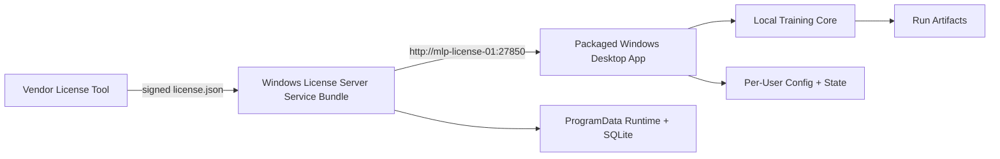

# Deployment Architecture

## Purpose

Implementation-oriented architecture for how `Surrogate Model Traning Suite`
moves from a source checkout into customer-facing Windows installs.

## Deployment Modes

- source checkout for development, tests, and internal tooling
- packaged Windows desktop app for design engineers
- packaged Windows license-server service bundle for customer IT
- internal vendor-tool runtime for signing and issuing licenses

## Deployment View

## Source Checkout Runtime

### Purpose

- developer-friendly local execution
- pytest coverage
- source-based smoke rehearsal

### Layout

- repo root contains source code and tracked packaging assets
- GUI state writes to `artifacts/gui/`
- default outputs write to `artifacts/output/`
- license-server local runtime writes under a non-repo runtime root when rehearsing

### Rules

- source mode may rely on repo-relative `artifacts/` paths
- source-mode smoke validation is not the same as clean-install acceptance
- internal vendor tooling may continue to run from a source checkout in this slice

## Packaged Windows Desktop App

### Install Topology

- installer: per-user EXE
- install root: `%LOCALAPPDATA%\Programs\Surrogate Model Traning Suite\`
- no administrator rights required for the design engineer install

### Writable State

- license client config: `%APPDATA%\Surrogate Model Traning Suite\license_client.json`
- session state and logs: `%LOCALAPPDATA%\Surrogate Model Traning Suite\`
- default run outputs: `%USERPROFILE%\Documents\Surrogate Model Traning Suite\Runs\`

### Runtime Boundary

- packaged GUI never writes runtime state into the install directory
- packaged GUI reads and writes the shared `license_client.json` file
- packaged GUI performs startup checkout, background heartbeat, and shutdown release

## Windows License Server Service Bundle

### Install Topology

- install root: `C:\Program Files\MLP License Server\`
- service runtime/data root: `%PROGRAMDATA%\MLP License Server\`
- service wrapper: bundled WinSW executable and rendered XML
- Python runtime: bundled with the server bundle so customer IT does not need a separate Python install

### Operational Components

- bundled FastAPI + Uvicorn server runtime
- bundled customer-admin CLI access through wrapper commands
- bundled PowerShell install script for registering and starting the Windows service
- sample config and logs located outside the install tree

### Network Boundary

- default IT-facing example URL: `http://mlp-license-01:27850`
- the host and port remain configurable
- desktop clients communicate over the customer LAN only
- normal runtime does not depend on vendor internet access

## Role Boundaries

### Release Engineering

- builds the Windows GUI installer
- builds the Windows server service bundle
- rehearses both artifacts from clean installs outside the repo

### Customer IT

- installs the Windows service bundle
- opens the chosen LAN port
- initializes the server, exports the request, imports the signed license
- shares the final server URL with design engineers

### Design Engineer

- installs the packaged GUI
- points the GUI at the on-prem server or receives a pre-seeded config
- consumes a floating seat while running the app

## Acceptance Boundary

- source-based validation remains useful for fast regressions
- release readiness requires an installed-artifact rehearsal outside the source folders
- the clean-install rehearsal must prove the same happy path as the current source-based smoke flow:
  `init -> export-request -> issue license -> import-license -> status -> checkout -> heartbeat -> release`

## Risks

- path drift between source and packaged modes can break state persistence
- Windows service packaging introduces more operational surface than pure Python development
- inconsistent product naming across docs can leak into installers and customer instructions

## Source References

- `overview.md`
- `gui_architecture.md`
- `license_server_architecture.md`
- `../implementation/windows_packaging_and_clean_install.md`
- `../integration/windows_packaged_install_rehearsal.md`
