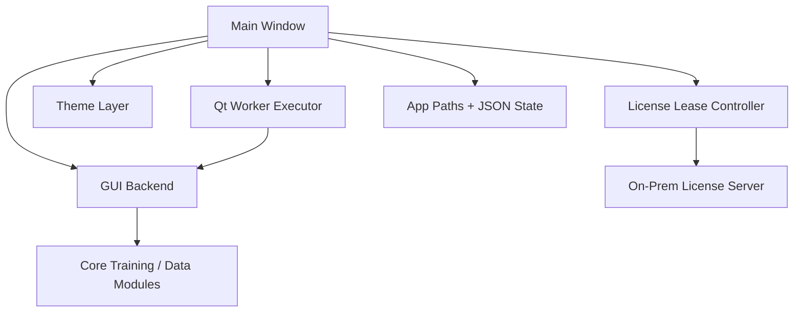

# GUI Architecture

## Purpose

Implementation-oriented architecture for the desktop GUI, including the window
layout, licensing boundary, task orchestration model, progress plumbing, and
state boundaries.

## Module Map

- `launch_gui.py`: entrypoint and application bootstrap
- `gui_window.py`: widgets, forms, plots, licensing controls, and interaction wiring
- `gui_backend.py`: GUI-facing adapters around training, scan, suggestion, and compatibility helpers
- `gui_workers.py`: background task execution, stop handling, and callback delivery
- `gui_theme.py`: palette, stylesheet, status colors, and plot styling
- `app_paths.py`: source-checkout vs packaged runtime-path policy
- `licensing/client_config.py`: shared per-user license client config helpers
- `licensing/controller.py`: checkout, heartbeat, grace, and release lifecycle

## High-Level Structure

## Design Rules

- widget code owns presentation, not training logic
- long-running work never runs on the UI thread
- backend helpers are the bridge into the training core
- progress payloads stay plain dictionaries
- saved state stays JSON-serializable
- licensing stays at the application boundary and never enters the training core
- packaged GUI state never writes into the install directory

## Window Composition

### Top Bar

- title and subtitle
- current run name summary
- config load/save actions
- manual environment detection action

### Left Pane

- license server card
- system and environment card
- data sources card
- dataset preview card
- scan-only suggestion card
- training settings tabs
- run controls card

The left pane is scrollable so advanced settings do not force the full window to
grow vertically.

### Right Pane

- compact metrics card
- monitor tabs
- run log

#### Monitor Tabs

- `Baseline Monitor`
  - training loss vs epoch
  - MAE over frequency
- `Test Samples`
  - predicted vs true curves for test-fold samples

## Runtime Flow

1. The app resolves source or packaged runtime paths through `xfmr_v2.app_paths`.
2. The window loads saved session state and the shared license-client config when available.
3. If a server URL is configured, the GUI attempts status-check plus checkout before enabling training work.
4. User updates paths or settings in the window.
5. Window validates local form state and starts a worker task.
6. Worker calls a GUI backend helper or training workflow wrapper.
7. Backend calls the core training or data modules.
8. Progress events flow back through Qt-safe callbacks.
9. Window normalizes payloads and updates license state, status text, metrics, plots, and run log.

## Task Model

Supported long-running task categories:

- environment detection
- dataset scan
- suggestion generation
- baseline training

Only one active task is allowed at a time. The current task owns the stop handle
and temporarily locks conflicting controls.

## Progress Contract

Progress is phase-based and event-based.

### Phases

- `scan`
- `suggest`
- `baseline`

The engine also emits a `transfer` phase. The GUI does not run that workflow and
ignores those events; `run_self_transfer.py` consumes them instead.

### Event Handling Expectations

- scan events update schema status, preview readiness, progress bar state, and scan log lines
- suggestion events update confidence, diagnostics, warnings, and suggested settings tables
- baseline events update metrics, loss curves, evaluation MAE, and run status

The GUI must tolerate payloads where fields arrive nested under a `data` object
or flattened at the top level.

## State Model

### Persistent

- selected paths
- output folder
- run name
- baseline form values
- saved config files
- last session
- license server URL

### Ephemeral

- active task handle
- latest scan result
- latest suggestion result
- latest workflow summary
- latest baseline summary
- current lease state
- plot-series data for the active window session

## Plot Ownership

- baseline plots are rebuilt from live progress and can also be rehydrated from final history
- plot styling lives in `gui_theme.py`
- live plotting remains optional from the perspective of the backend, which only emits structured progress

## Concurrency Model

- one task handle per active workflow
- worker startup must not race the underlying Qt thread lifecycle
- progress, result, error, and finished callbacks must all cross back to the main thread safely
- stop requests are cooperative rather than forced thread termination
- heartbeat work runs separately from the training-task executor

## Integration Boundary With Training Core

- core modules stay reusable from CLI and GUI
- GUI never owns model training loops
- GUI backend converts user-form state into core config objects
- compatibility checks, cache handling, and suggestion logic stay outside widget methods
- the training core remains license-agnostic

## Integration Boundary With Licensing

- the shared per-user config file is `license_client.json`
- startup checkout determines whether the main training actions may begin
- background heartbeats keep the seat alive while the GUI is running
- clean shutdown attempts a release
- heartbeat-loss grace behavior belongs in the GUI licensing layer, not the training core

## Packaged Path Behavior

- source checkout uses repo-relative `artifacts/` paths
- packaged Windows runs use `%APPDATA%`, `%LOCALAPPDATA%`, and `Documents`
- the GUI must behave the same way whether the server URL is user-entered or pre-seeded by customer IT

## Risks

- `gui_window.py` can become too large without view-model or panel extraction
- session restore can become brittle if config shape changes silently
- progress and license-state schemas can drift if backend and GUI evolve independently
- stale packaging docs can make installed behavior look broken even when code is correct

## Source References

- `../../launch_gui.py`
- `../../xfmr_v2/gui_window.py`
- `../../xfmr_v2/gui_backend.py`
- `../../xfmr_v2/gui_workers.py`
- `../../xfmr_v2/gui_theme.py`
- `../../xfmr_v2/app_paths.py`
- `../../xfmr_v2/licensing/`
