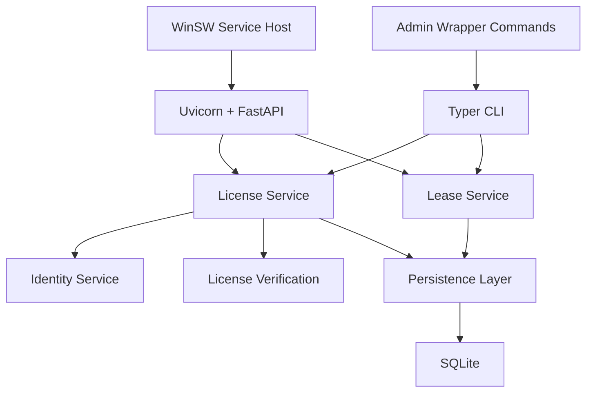

# License Server Architecture

## Purpose

Implementation-oriented architecture for the on-prem floating license server,
including the Windows service-bundle boundary used for customer installs.

## Logical Components

## Module Layout

- `license_server/api`: client routes and FastAPI wiring
- `license_server/cli`: customer-admin CLI entrypoints
- `license_server/crypto`: host fingerprinting and license verification helpers
- `license_server/db`: SQLAlchemy models, sessions, and repository helpers
- `license_server/schemas`: Pydantic request and response models
- `license_server/service`: runtime bootstrap, config, path resolution, and shared utilities
- `license_server/services`: identity, license import, lease, and audit behavior

## Design Rules

- business rules live in services, not route handlers
- customer admin remains CLI-first for MVP
- signed licenses are the source of truth for seat count and features
- client apps never decide seat validity locally
- one active imported license per server is enough for MVP
- install-time packaging stays separate from package runtime code

## Runtime Topology

### Windows

- packaged as a self-contained Windows service bundle
- install root: `C:\Program Files\MLP License Server\`
- runtime/config/data root: `%PROGRAMDATA%\MLP License Server\`
- bundled Python runtime or dedicated bundled virtual environment
- bundled WinSW executable and rendered service XML
- bundled admin wrapper commands for `init`, `export-request`, `import-license`, `show-status`, and `show-audit`
- default IT-facing example URL: `http://mlp-license-01:27850`

### Linux

- packaged as a service bundle with `systemd`
- install root: `/opt/mlp-license-server/`
- config root: `/etc/mlp-license-server/`
- data root: `/var/lib/mlp-license-server/`
- admin CLI behavior matches the Windows server
- default IT-facing example URL also uses port `27850` unless the host overrides it

## Core Workflows

### Initial Setup

1. Customer IT installs the service bundle.
2. Service starts and creates a persistent server identity.
3. Customer IT exports a request file.
4. Vendor returns a signed eval or paid license.
5. Customer IT imports the license through the CLI.

### Runtime Seat Control

1. Desktop app calls `checkout`.
2. Server verifies license validity and seat availability.
3. Server creates a lease with expiry.
4. App heartbeats periodically.
5. App releases on shutdown or lease expires on silence.

### License Replacement

1. Customer imports a replacement license.
2. Server verifies signature and server binding.
3. Server swaps the active license.
4. If seats were reduced, excess active leases are evicted immediately.

## API Surface

### Client API

- `POST /api/v1/checkout`
- `POST /api/v1/heartbeat`
- `POST /api/v1/release`
- `GET /api/v1/status`

### Admin Contract

Customer-facing admin stays CLI-first, even when the service is packaged for Windows or Linux.

## Data Model

- `server_identity`
- `active_license`
- `seat_leases`
- `audit_events`

Rules:

- active seats are unexpired, unreleased leases
- audit events are append-only
- the current imported license is authoritative for seat count and term

## Security Model

- vendor private key never ships to customers
- customer server verifies signed licenses locally
- host/server binding is checked on import
- client inputs are treated as untrusted
- normal runtime has no vendor internet dependency

## Deployment Boundary

- service scripts, sample configs, and WinSW templates live under `packaging/license_server/`
- repo code stays importable without bundled-service assumptions
- packaged runtime and customer data stay outside the source checkout

## Failure Handling

- failed license import leaves the current license unchanged
- expired or crashed clients lose seats through lease expiry
- service restart preserves active license and recomputes lease state
- misconfigured packaged installs must be diagnosable through logs and CLI status output

## Risks

- Windows service packaging is still the largest MVP operational cost
- CLI-only admin keeps build scope smaller but raises documentation burden
- path drift between bundle layout and `%PROGRAMDATA%` runtime handling will create avoidable support work

## Source References

- `../prd/license_server_prd.md`
- `../prd/deployment_prd.md`
- `../tech_stack/tech_stack_license_server.md`
- `deployment_architecture.md`
- `../implementation/windows_packaging_and_clean_install.md`
