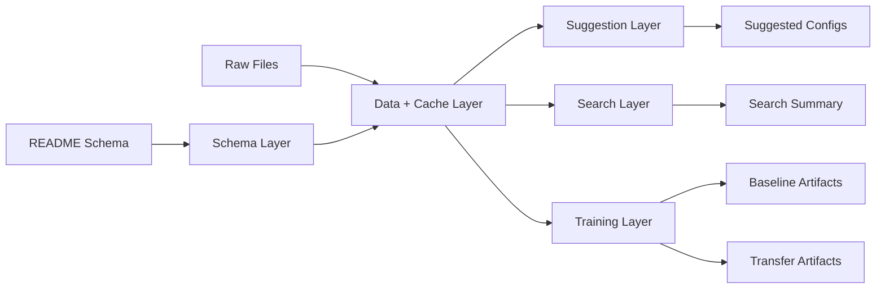

# MLP Training Architecture

## Purpose

Implementation-oriented architecture for the core training workflow.

## Module Map

- `dataset_schema.py`: README schema extraction and validation
- `data.py`: raw-data loading, cache creation, split preparation
- `suggest.py`: scan-only heuristics
- `search.py`: bounded quick search around a suggested baseline
- `model.py`: feed-forward surrogate models (SpectraNet, SpectraHydra)
- `runner.py`: baseline and transfer execution, evaluation, artifact writing
- CLI wrappers: thin command entrypoints

## Flow

## Design Rules

- dataset contract is explicit and README-driven
- training modules remain Qt-free
- configs stay lightweight with dataclasses
- progress is emitted as structured events
- outputs stay file-based and machine-readable

## Data and Artifact Model

### Inputs

- input-feature file
- ground-truth data folder
- dataset README schema
- output folder and optional cache path

### Persistent Outputs

- cache: `.npz`
- checkpoint: `.pt`
- summaries: `.json`
- plots: `.png`

## Execution Paths

### Suggestion

- ensure or build cache
- load training-split statistics
- compute diagnostics
- return baseline and transfer recommendations

### Quick Search

- start from suggested baseline
- generate nearby candidates
- run short baseline trials
- rank and save results

### Baseline Training

- load cache and split bundle
- create model, optimizer, scheduler, AMP state
- train and track best checkpoint
- evaluate and write artifacts

### Self-Transfer

- load compatible baseline run
- validate cache/run compatibility
- iterate over transfer bands and steps
- save transfer outputs separately

## Cross-Cutting Concerns

### Reproducibility

- explicit seeds
- deterministic splits
- persisted configs and summaries

### Observability

- structured progress events
- saved histories and metrics
- artifact folders per run

### Boundary with GUI

- GUI calls backend helpers only
- no Qt types in core training modules

### Boundary with Licensing

- license checks happen before workflow entry
- core training logic stays license-agnostic

## Risks

- `runner.py` can become too large if more workflows are added
- output-folder structure can drift if conventions are not maintained
- quick search can grow into an unbounded feature if not kept intentionally small

## Source References

- `../../xfmr_v2/dataset_schema.py`
- `../../xfmr_v2/data.py`
- `../../xfmr_v2/suggest.py`
- `../../xfmr_v2/search.py`
- `../../xfmr_v2/model.py`
- `../../xfmr_v2/runner.py`
