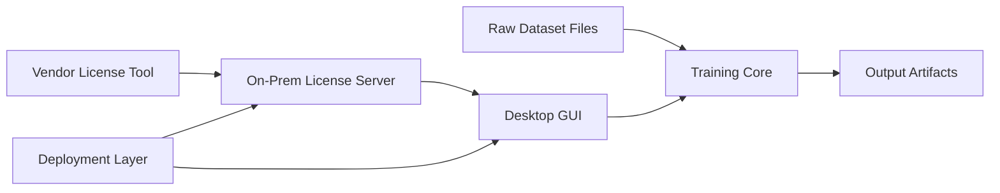

# Architecture Overview

## Purpose

High-level architecture for `Surrogate Model Training Suite`.

## Product Components

- MLP training workflow
- desktop GUI
- on-prem floating license server
- deployment and packaging layer

## System View

## Architectural Rules

- training logic stays independent of GUI and licensing
- GUI is a thin orchestration layer over backend modules
- licensing sits at the application boundary, not inside the core training loop
- packaged installs keep writable state outside the install directory
- release validation must distinguish source-checkout behavior from packaged-install behavior

## Runtime Topology

### Source Checkout

- CLI or GUI invokes local training modules
- training runs on local CPU/GPU
- repo-relative `artifacts/` paths remain available for development-friendly workflows

### Packaged Windows Deployment

- the desktop app installs per-user under `%LOCALAPPDATA%`
- the license server installs as a Windows service bundle under `C:\Program Files\MLP License Server\`
- customer runtime data stays under `%APPDATA%`, `%LOCALAPPDATA%`, `%USERPROFILE%\Documents`, and `%PROGRAMDATA%`

## Storage By Domain

- training: `.npz`, `.pt`, `.json`, `.png`
- GUI: JSON config, session state, and per-user license-client config
- licensing: signed JSON license plus SQLite audit/store
- deployment: installers, service bundles, and install-smoke outputs

## Main Boundaries

### Training <-> GUI

- progress contract is structured Python dictionaries
- GUI does not own training logic

### GUI <-> License Server

- startup checkout
- periodic heartbeat
- release on shutdown

### Vendor Tool <-> License Server

- signed license issuance
- local signature verification on import

### Build-Time <-> Runtime

- packaging assets stay outside package code
- packaged runtime paths must not rely on the source checkout

## Suggested Build Order

1. keep training architecture stable
2. keep GUI thin around the training core
3. keep the license server as a separate component
4. package the Windows GUI and Windows server with explicit runtime boundaries
5. validate the delivery flow from clean installs outside the repo

## Related Docs

- `../prd/mlp_training_prd.md`
- `../prd/gui_prd.md`
- `../prd/license_server_prd.md`
- `../prd/deployment_prd.md`
- `mlp_training_architecture.md`
- `gui_architecture.md`
- `license_server_architecture.md`
- `deployment_architecture.md`
